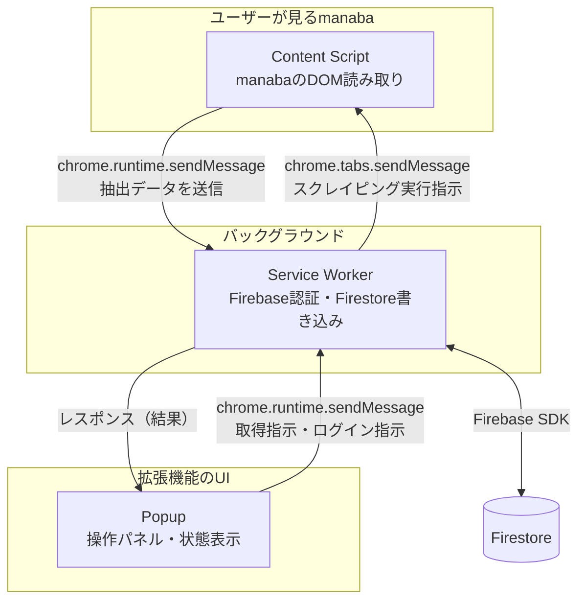
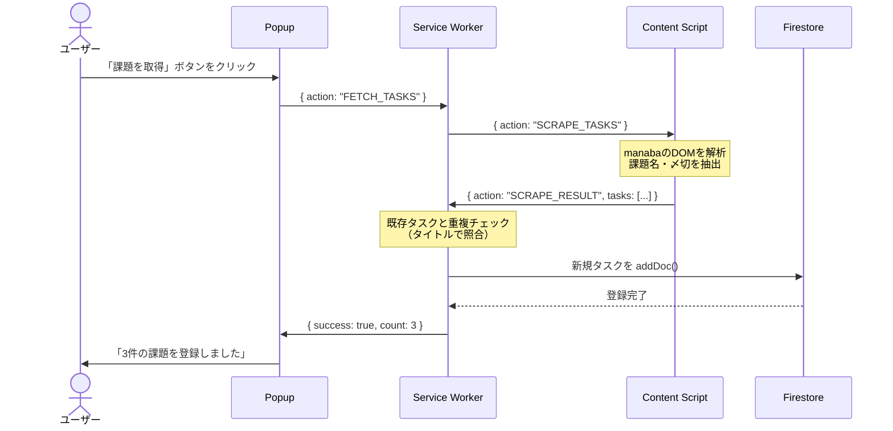
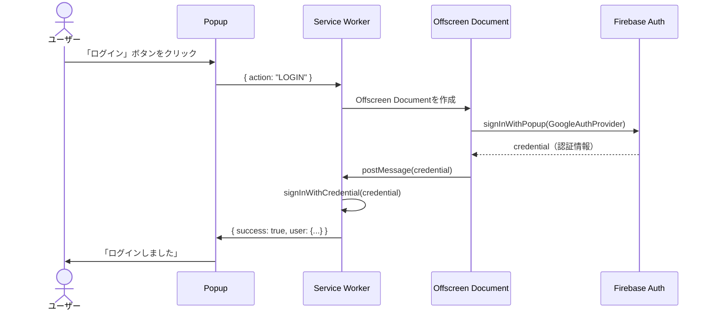

# SyncScale Chrome拡張機能 — System Design Document

> **SyncScale システムの「自動収集」を担うChrome拡張機能**
> 
> LMS（manaba等）から課題と〆切データを自動取得し、Firestoreへ登録する。

---

## 1. 概要

### 1.1 本拡張機能の位置づけ

SyncScaleは3つの制作物から構成される学生向けタスク管理能力認知支援ツールである。
本Chrome拡張機能は、そのうち **Step 1「自動収集」** を担当する。

| Step | 手法 | 担当 |
|------|------|------|
| **1. 自動収集** ★ | LMSから課題・〆切を自動取得 | **Chrome拡張機能（本設計書）** |
| 2. 相対見積もり | S/M/L ラベリング | スマートフォンアプリ |
| 3. 計測と振り返り | タイマー計測・コンディション入力 | スマートフォンアプリ |
| 4. データの可視化 | ダッシュボードで分析 | PCのWebアプリ |

### 1.2 目的

- manabaの「未提出課題」ページから、**課題名**と**〆切日時**を自動で抽出する
- 抽出データをFirestoreの `tasks` コレクションへ登録する
- **手入力の手間を省き、タスクの登録漏れを防ぐ**

### 1.3 連携先

- **Firestore**: Webアプリ・スマホアプリと同一のコレクション（`tasks`）に書き込む
- **Firebase Auth**: Webアプリと同一のユーザーとしてログインする

---

## 2. Chrome拡張機能のアーキテクチャ

### 2.1 Manifest V3 のコンポーネント構成

Chrome拡張機能は、3つの独立した実行環境（コンテキスト）から構成される。
それぞれ役割が異なり、相互に**メッセージング**で通信する。



### 2.2 各コンテキストの役割

| コンテキスト | ファイル | 役割 | できること | できないこと |
|---|---|---|---|---|
| **Content Script** | `content.js` | manabaのDOM読み取り | ページのDOM操作、データ抽出 | Firebase直接操作、拡張UI表示 |
| **Popup** | `popup.html/js` | ユーザーとの対話 | ボタン表示、状態表示、指示送信 | DOM読み取り（他サイト） |
| **Service Worker** | `background.js` | 中央制御・Firebase通信 | Firebase Auth/Firestore操作、メッセージ中継 | DOM操作、UI表示 |

### 2.3 なぜこの分離が必要か（初心者向け解説）

```
❓ 「全部1つのファイルでやればいいのでは？」

❌ Chrome拡張機能では、セキュリティ上の理由から
   1つのスクリプトが「全て」をやることはできません。

📌 Content Script:
   → manabaのページ「の中に」注入されるスクリプト。
   → manabaのHTMLを読めるが、拡張機能のUIやFirebaseには直接触れない。
   → 理由: もしContent ScriptがFirebaseにアクセスできたら、
           manabaページ上の悪意あるスクリプトがそれを利用できてしまう。

📌 Service Worker:
   → 拡張機能の「裏方」。バックグラウンドで動く。
   → Firebaseの認証やデータ保存を担当する。
   → 理由: ユーザーの認証情報を安全な場所で管理するため。

📌 Popup:
   → 拡張機能のアイコンをクリックした時に出る小さなウィンドウ。
   → ユーザーにボタンや状態を見せる「フロントエンド」。
```

---

## 3. ファイル構造

```
SyncScale-chromeEx/
├── docs/
│   └── SystemDesign.md          # 本設計書
├── src/
│   ├── manifest.json            # 拡張機能の設定ファイル（Manifest V3）
│   ├── popup/
│   │   ├── popup.html           # ポップアップのHTML
│   │   ├── popup.js             # ポップアップのロジック
│   │   └── popup.css            # ポップアップのスタイル
│   ├── background/
│   │   └── background.js        # Service Worker（Firebase通信・メッセージ中継）
│   ├── content/
│   │   └── content.js           # Content Script（manabaのDOM解析）
│   ├── lib/
│   │   └── firebase-config.js   # Firebase初期化設定
│   └── icons/
│       ├── icon16.png
│       ├── icon48.png
│       └── icon128.png
├── concept.md
└── README.md
```

---

## 4. データフロー（メッセージング設計）

### 4.1 メインフロー: 課題の取得 → Firestore登録



### 4.2 認証フロー: Googleログイン

Manifest V3では、`signInWithPopup` がContent Scriptで使えないため、
**Offscreen Document** を使うか、または**Webアプリ側でログイン済みの状態**を利用する。



> **補足**: Offscreen Documentは「見えない隠しページ」で、
> 通常のWebページと同じ環境でFirebase認証を処理できる特殊なページです。
> Manifest V3のセキュリティ制約を回避するために使います。

---

## 5. コンポーネント詳細設計

### 5.1 manifest.json

```json
{
  "manifest_version": 3,
  "name": "SyncScale - manaba課題取得",
  "version": "0.1.0",
  "description": "manabaから課題と〆切を自動取得し、SyncScaleに登録します",
  
  "permissions": [
    "activeTab",
    "storage",
    "offscreen"
  ],
  
  "host_permissions": [
    "https://*.manaba.jp/*",
    "https://*.firebaseapp.com/*",
    "https://*.firebaseio.com/*",
    "https://www.googleapis.com/*"
  ],
  
  "background": {
    "service_worker": "background/background.js",
    "type": "module"
  },
  
  "content_scripts": [
    {
      "matches": ["https://*.manaba.jp/*"],
      "js": ["content/content.js"],
      "run_at": "document_idle"
    }
  ],
  
  "action": {
    "default_popup": "popup/popup.html",
    "default_icon": {
      "16": "icons/icon16.png",
      "48": "icons/icon48.png",
      "128": "icons/icon128.png"
    }
  },
  
  "icons": {
    "16": "icons/icon16.png",
    "48": "icons/icon48.png",
    "128": "icons/icon128.png"
  }
}
```

#### `host_permissions` の解説

```
"https://*.manaba.jp/*"
→ Content Scriptがmanabaのページで動作するために必要。
  大学ごとにURLが異なるため、*.manaba.jp でワイルドカード指定。
  （例: ct.manaba.jp, manaba.tsukuba.ac.jp など）

"https://*.firebaseapp.com/*" 等
→ Service WorkerがFirebase（認証・DB）と通信するために必要。
```

> ⚠️ **注意**: 大学によってmanabaのURLが `*.manaba.jp` 以外の場合がある。
> その場合、`host_permissions` と `content_scripts.matches` に
> 該当のURLパターンを追加する必要がある。

---

### 5.2 Content Script（content.js）

manabaのページからタスク情報を抽出する。**DOMの読み取りのみ**を担当する。

#### 役割
- manabaの「未提出課題」一覧ページのHTMLを解析
- 課題名（タイトル）と〆切日時を抽出
- 抽出結果をService Workerへ送信

#### 設計方針
```
📌 Content Scriptは「データを読む」だけ。
   Firebaseへの書き込みや認証はService Workerに任せる。
   
📌 manabaのHTML構造は大学ごとに微妙に異なる可能性がある。
   セレクタが見つからない場合のエラーハンドリングを必ず行う。
```

#### 処理の流れ

```javascript
// content.js の擬似コード

// 1. Service Workerからのメッセージを待ち受ける
chrome.runtime.onMessage.addListener((message, sender, sendResponse) => {
  if (message.action === "SCRAPE_TASKS") {
    console.log("[Content Script] スクレイピング開始");

    // 2. manabaのDOMから課題情報を抽出する
    const tasks = scrapeTasks();
    console.log("[Content Script] 抽出結果:", tasks);

    // 3. 結果をService Workerへ返す
    sendResponse({ success: true, tasks: tasks });
  }
});

/**
 * manabaの課題一覧からタスク情報を抽出する
 * @returns {Array<{title: string, deadline: string}>}
 */
function scrapeTasks() {
  const tasks = [];
  
  // ※ 実際のセレクタは開発者ツール(F12)で確認して調整する
  // manabaの課題行を全て取得
  const rows = document.querySelectorAll("課題行のセレクタ");
  
  rows.forEach(row => {
    // 課題名を取得
    const titleEl = row.querySelector("タイトルのセレクタ");
    // 〆切日時を取得
    const deadlineEl = row.querySelector("〆切のセレクタ");
    
    if (titleEl && deadlineEl) {
      tasks.push({
        title: titleEl.textContent.trim(),
        deadline: deadlineEl.textContent.trim(),
      });
    }
  });
  
  return tasks;
}
```

> **実装時の注意**: 上記のセレクタは仮のものです。
> 実装Phase 1で、実際のmanabaページをChromeの開発者ツール（F12）で確認し、
> 正しいCSSセレクタに置き換えます。

---

### 5.3 Service Worker（background.js）

拡張機能の**中央制御**。Firebase通信とメッセージ中継を担当する。

#### 役割
- Firebase Auth による認証管理
- Content Scriptから受け取った課題データをFirestoreへ書き込み
- **重複チェック**: 既にFirestoreに同じタイトルの課題が存在する場合はスキップ
- Popup へ結果を返す

#### 処理の流れ

```javascript
// background.js の擬似コード

import { initializeApp } from 'firebase/app';
import { getAuth } from 'firebase/auth/web-extension';
import { getFirestore, collection, addDoc, query, where, getDocs, Timestamp }
  from 'firebase/firestore';

// Firebase初期化
const app = initializeApp(firebaseConfig);
const auth = getAuth(app);
const db = getFirestore(app);

// メッセージリスナー
chrome.runtime.onMessage.addListener((message, sender, sendResponse) => {
  
  // === 課題取得フロー ===
  if (message.action === "FETCH_TASKS") {
    handleFetchTasks(sendResponse);
    return true; // 非同期レスポンスを返すため true を返す
  }
  
  // === ログインフロー ===
  if (message.action === "LOGIN") {
    handleLogin(sendResponse);
    return true;
  }
});

/**
 * 課題取得の全体フロー
 * 1. 現在のタブのContent Scriptにスクレイピングを依頼
 * 2. 結果を受け取り、重複チェック後にFirestoreへ登録
 */
async function handleFetchTasks(sendResponse) {
  try {
    // 現在のユーザーを確認
    const user = auth.currentUser;
    if (!user) {
      sendResponse({ success: false, error: "ログインしてください" });
      return;
    }
    
    // 現在のアクティブタブを取得
    const [tab] = await chrome.tabs.query({ active: true, currentWindow: true });
    
    // Content Scriptにスクレイピングを依頼
    const response = await chrome.tabs.sendMessage(tab.id, { action: "SCRAPE_TASKS" });
    
    if (!response.success || !response.tasks.length) {
      sendResponse({ success: false, error: "課題が見つかりませんでした" });
      return;
    }
    
    // 重複チェック & Firestore登録
    const newCount = await registerTasks(user.uid, response.tasks);
    
    sendResponse({ success: true, count: newCount });
  } catch (error) {
    console.error("[Service Worker] エラー:", error);
    sendResponse({ success: false, error: error.message });
  }
}

/**
 * 重複チェック後にFirestoreへタスクを登録する
 * @param {string} userId - ログイン中のユーザーUID
 * @param {Array} scrapedTasks - スクレイピングで取得したタスク配列
 * @returns {number} 新規登録された件数
 */
async function registerTasks(userId, scrapedTasks) {
  // 既存タスクのタイトル一覧を取得（重複チェック用）
  const existingQuery = query(
    collection(db, 'tasks'),
    where('userId', '==', userId),
    where('source', '==', 'chrome_ext')
  );
  const existingSnap = await getDocs(existingQuery);
  const existingTitles = new Set(
    existingSnap.docs.map(doc => doc.data().title)
  );
  
  let newCount = 0;
  
  for (const task of scrapedTasks) {
    // タイトルが既に存在する場合はスキップ
    if (existingTitles.has(task.title)) {
      console.log(`[Service Worker] スキップ（重複）: ${task.title}`);
      continue;
    }
    
    // Firestoreへ新規登録
    // ※ WebアプリのSystemDesign-v2と同一スキーマに合わせる
    await addDoc(collection(db, 'tasks'), {
      userId: userId,
      title: task.title,
      deadline: parseDeadline(task.deadline),  // 文字列 → Timestamp に変換
      estimatedMinutes: 0,                     // 見積もりは未設定
      status: 'TODO',
      isVisible: true,
      sizeLabel: null,                         // ラベルは後でスマホアプリ等から設定
      source: 'chrome_ext',                    // 登録元を記録
      startedAt: null,
      completedAt: null,
      createdAt: Timestamp.now(),
    });
    
    newCount++;
    console.log(`[Service Worker] 登録完了: ${task.title}`);
  }
  
  return newCount;
}

/**
 * manabaの〆切文字列をFirestore Timestampに変換する
 * 例: "2026-06-15 23:59" → Timestamp
 */
function parseDeadline(deadlineStr) {
  // manabaの日時フォーマットに合わせて実装する
  const date = new Date(deadlineStr);
  if (isNaN(date.getTime())) {
    console.warn(`[Service Worker] 日付パース失敗: ${deadlineStr}`);
    return null;
  }
  return Timestamp.fromDate(date);
}
```

---

### 5.4 Popup（popup.html / popup.js）

ユーザーが拡張機能のアイコンをクリックした時に表示される小さなウィンドウ。

#### 役割
- ログイン状態の表示
- 「課題を取得」ボタンの提供
- 取得結果（成功/失敗/件数）の表示

#### UI設計

```
┌──────────────────────────────┐
│  🔄 SyncScale                 │
│                              │
│  ───── 認証状態 ─────         │
│  ✅ ログイン中: user@gmail    │
│  [ログアウト]                 │
│                              │
│  ───── 課題取得 ─────         │
│  ℹ️ manabaの課題ページを       │
│     開いた状態で押してください │
│                              │
│  [ 📥 課題を取得する ]        │
│                              │
│  ✅ 3件の課題を登録しました   │
│  ⏭️ 2件はすでに登録済み       │
│                              │
└──────────────────────────────┘
```

#### popup.html（概要）

```html
<!DOCTYPE html>
<html lang="ja">
<head>
  <meta charset="UTF-8">
  <link rel="stylesheet" href="popup.css">
</head>
<body>
  <div class="container">
    <h1 class="title">🔄 SyncScale</h1>
    
    <!-- 認証エリア -->
    <section id="auth-section">
      <div id="logged-in" style="display:none;">
        <p>✅ <span id="user-email"></span></p>
        <button id="logout-btn">ログアウト</button>
      </div>
      <div id="logged-out">
        <button id="login-btn">Google ログイン</button>
      </div>
    </section>
    
    <!-- 課題取得エリア -->
    <section id="fetch-section">
      <p class="hint">manabaの課題ページを開いた状態で押してください</p>
      <button id="fetch-btn">📥 課題を取得する</button>
      <div id="result-area"></div>
    </section>
  </div>
  
  <script src="popup.js" type="module"></script>
</body>
</html>
```

---

## 6. Firestoreへの書き込みスキーマ

Chrome拡張機能が `tasks` コレクションに書き込む際のデータ形式。
**WebアプリのSystemDesign-v2と完全に一致**させること。

```javascript
{
  userId: "Firebase AuthのUID",
  title: "manabaから取得した課題名",
  deadline: Timestamp,          // manabaの〆切日時をTimestamp型に変換
  estimatedMinutes: 0,          // Chrome拡張では見積もりは未設定
  status: "TODO",               // 初期ステータスは必ずTODO
  isVisible: true,
  sizeLabel: null,              // S/M/LはWebアプリ or スマホアプリで設定
  source: "chrome_ext",         // ★ 登録元を明示
  startedAt: null,
  completedAt: null,
  createdAt: Timestamp.now(),
}
```

### 重複チェックのロジック

```
同一ユーザー（userId）かつ
同一登録元（source: 'chrome_ext'）かつ
同一タイトル（title）
→ すでに存在する場合はスキップ
```

> **補足**: タイトルだけの一致で判定しているため、
> 同名の別課題（異なる科目で同じ名前の課題）がある場合は
> 誤って重複と判定される可能性がある。
> 将来的には `title + deadline` の組み合わせや、
> manaba上の課題IDを取得する方法を検討する。

---

## 7. 技術スタック

| 区分 | 技術 | 備考 |
|------|------|------|
| 拡張機能基盤 | Chrome Extension Manifest V3 | 最新の拡張機能仕様 |
| 認証 | Firebase Auth (`firebase/auth/web-extension`) | Manifest V3専用のSDKエントリポイント |
| DB | Firebase Firestore | Webアプリと同一プロジェクト |
| ビルド | （候補: Webpack / Vite） | `import` 構文を使うためにバンドラが必要 |
| 言語 | JavaScript (ES Modules) | — |

### Firebase SDK のインポートについて

Manifest V3 では、Content Script内で `import` 文が使えないなどの制約がある。
そのため、**Webpack** や **Vite** 等のバンドラを使って、
各エントリポイント（`background.js`, `popup.js`, `content.js`）を
個別にビルドする構成が必要。

```
src/background/background.js  → dist/background.js  (バンドル済み)
src/popup/popup.js             → dist/popup.js       (バンドル済み)
src/content/content.js         → dist/content.js     (バンドル済み)
```

---

## 8. セキュリティ考慮事項

### 8.1 Content ScriptとFirebaseの分離

| 懸念 | 対策 |
|------|------|
| Content ScriptがFirebaseに直接アクセスすると、manabaページ上のスクリプトから認証情報を盗まれる可能性 | Firebase操作は**Service Worker内のみ**で行い、Content ScriptはDOM読み取りのみに限定 |
| APIキーの露出 | `firebase-config.js` に記述するが、Firestoreセキュリティルールで保護されているため、APIキー単体では他人のデータにアクセスできない |

### 8.2 XSSリスクについて

先述の通り、**この仕組みはXSSには該当しない**。

- Chrome拡張 → Firestore → Webアプリ のデータフローは「自分→DB→自分」
- ReactがJSX内の `{task.title}` を自動エスケープするため、manabaから取得した文字列にHTMLタグが含まれていても無害化される
- `dangerouslySetInnerHTML` は使用しない

### 8.3 manabaへの配慮

| 項目 | 方針 |
|------|------|
| アクセス頻度 | ユーザーが手動でボタンを押した時のみ実行。自動巡回はしない |
| データ範囲 | 課題名と〆切のみ。個人情報や成績データは取得しない |
| 利用範囲 | 個人の学習管理目的に限定 |

---

## 9. 実装Phase

### Phase 1: manabaのHTML構造調査 & Content Script開発
- Chromeの開発者ツール（F12）でmanabaの課題一覧ページのHTML構造を調査
- CSSセレクタを特定し、`content.js` にスクレイピングロジックを実装
- **ダミーデータでconsole.logに出力する**ところまで

### Phase 2: Popup UI & メッセージング
- `popup.html/css/js` の実装（ボタン、状態表示）
- Content Script ↔ Service Worker ↔ Popup 間のメッセージングを実装
- **まだFirebaseには接続しない。console.logで動作確認する段階**

### Phase 3: Firebase認証の実装
- `firebase/auth/web-extension` を使ったGoogleログインの実装
- Offscreen Document の作成（必要な場合）
- Webアプリと同じFirebaseプロジェクトの設定

### Phase 4: Firestore書き込みの実装
- 重複チェックロジックの実装
- `tasks` コレクションへの書き込み（`source: 'chrome_ext'`）
- Webアプリ側でChrome拡張から登録されたタスクが表示されることを確認

### Phase 5: ビルド環境 & 配布準備
- Webpack or Vite によるビルドパイプラインの構築
- Chrome Web Storeへの公開準備（任意）
