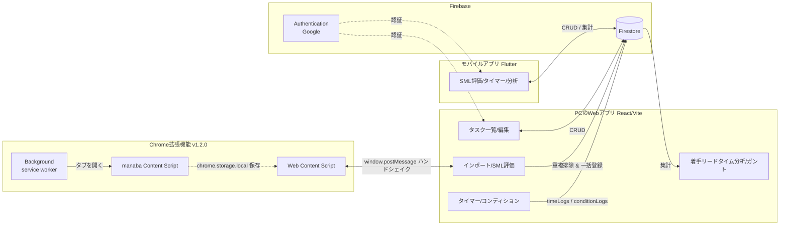

# SyncScale — System Design Document v3

> **相対見積もり（S/M/L）を用いた、学生向けタスク管理能力・メタ認知支援ツール**
>
> 本書は `docs/` 配下に点在していた設計文書（`concept.md` / `architecture/requirements.md` / `architecture/SystemDesign.md` / `architecture/SystemDesign-v2.md`）を統合した **唯一の正典（Single Source of Truth）** である。以降の設計議論は本書を基準とする。
>
> | 対象 | バージョン（本書作成時点） |
> |---|---|
> | Web アプリ (React/Vite) | `0.3.x` |
> | Chrome 拡張機能 (MV3) | `1.2.0` |
> | モバイルアプリ (Flutter) | `1.0.0` |

---

## 0. v1/v2 からの主要な変更点（廃止・確定事項）

本書は「仕様書」ではなく「実装」を正とする方針（実装優先）で整流したものである。旧文書との差分は以下のとおり。

| 項目 | 旧文書での記述 | v3 での確定 |
|---|---|---|
| 見積もり方式 | 数値（`estimatedMinutes`・分） / SML が混在 | **SML（S/M/L）相対見積もりのみ** |
| SML 入力の場所 | concept=スマホ / v2=PC で矛盾 | **Web アプリ・Flutter アプリの両方で入力可能** |
| 時間負債（実績−見積） | 中核機能として記載 | **廃止**（概念・計算・UI・`estimatedMinutes` フィールドをすべて削除） |
| AI（Gemini / サブタスク提案） | `aiService` / `system.GEMINI` を記載 | **廃止**（未実装・プロンプト定義ファイルも削除） |
| 認証 | 匿名認証＋Google アカウント連携（Account Linking / `AccountMergeModal`） | **Google ログインのみ**（匿名認証・連携モーダルは不採用） |
| 着手リードタイムの定義 | 「登録日(createdAt)→着手日(startedAt)」 | **「着手日(startedAt)が締切(deadline)の何日前か」**（= deadline − startedAt） |

---

## 1. コンセプト

### 1.1 解決する課題
学生が抱える「締切に追われる」心理的負担の根本原因は、**自身の時間見積もり能力の甘さ**と**着手の先延ばし**にある。従来のタスク管理ツールは「締切の管理」は支援するが、**「タスク規模ごとの着手の癖（先延ばし傾向）」を可視化する機能は存在しなかった**。

### 1.2 目的
学生が、タスク規模（S/M/L）ごとの **着手リードタイム（締切の何日前に着手したか）** と、タイマーログから自動生成される **実績ガントチャート** を通じて、自身の「時間の使い方の癖」を客観的に自覚（メタ認知）し、セルフマネジメント能力を向上させること。

### 1.3 アプローチ（4ステップ）

| Step | 手法 | 担当プロダクト |
|------|------|----------------|
| 1. 自動収集 | LMS（manaba 等）から課題・締切を自動取得 | **Chrome 拡張機能** |
| 2. 相対見積もり | 課題に対して S/M/L をラベリング | **Web アプリ / Flutter アプリ** |
| 3. 計測と振り返り | タイマーで実働時間を計測、完了時にコンディション入力 | **Web アプリ / Flutter アプリ** |
| 4. データの可視化 | 着手リードタイム・実績ガントチャートを表示 | **Web アプリ / Flutter アプリ** |

### 1.4 新規性
- **相対見積もり（SML）× 先延ばし可視化**: 「完了/未完了」ではなく「タスク規模ごとに、いつ着手したか」に着目し、先延ばしの癖をメタ認知させる。
- **実績ガントチャートの自動生成**: 従来「未来の計画」のために高コストで作るガントチャートを、タイマーログから「過去の実績」として自動生成し、計画立案の負荷なしに内省機会を提供する。

---

## 2. システム全体像

### 2.1 3 つの制作物とデータフロー



### 2.2 各プロダクトの役割

#### 🌐 Web アプリ（React / Vite）
- タスクの一覧管理・編集・論理削除・物理削除（カスケード削除）
- タスク規模別 **着手リードタイム分析**（`AnalyticsPanel`）
- 作業ログの **積み上げ式実績ガントチャート**（`GanttChart`）
- 〆切カレンダーによる俯瞰
- タイマー計測・手動（事後）記録・完了時コンディション入力
- 同意取得（研究利用同意）・オンボーディング・チュートリアル
- Chrome 拡張機能とのハンドシェイク連携（`window.postMessage`）

#### 🔌 Chrome 拡張機能（Manifest V3, v1.2.0）
- manaba の課題一覧ページから課題名・締切・科目をスクレイピング。
- **Storage ベースのイベント駆動連携**: `chrome.tabs.sendMessage` の直接通信を使わず、各ページが自分で `chrome.storage.local` を参照して次の動作を行うバケツリレー方式。`chrome.storage.onChanged` で SyncScale タブへリアルタイム再送。
- **Firebase へ直接接続しない**: 拡張機能内に Firebase 資格情報を保持しない設計（後述 §9）。

#### 📱 モバイルアプリ（Flutter）
- 外出先での SML 評価・タイマー計測・コンディション入力・着手リードタイム分析・実績ガント。
- 同一 Firestore を参照し、Web とリアルタイム同期。
- Firebase 資格情報は実行時に注入（後述 §9）。

### 2.3 連携設計ポリシー
- **Firebase を Single Source of Truth とする。**
- **Chrome 拡張機能は Firebase に直接接続しない。** Web アプリの動作中タブを介したメッセージ連携のみ。拡張機能内に API キーや認証トークンを保持・露出させない。
- 拡張機能と Web は `chrome.storage.local` と `window.postMessage`（ハンドシェイク）でやり取りするため、ページロードのタイミング差によるデータロストが起きにくい。
- Web が未ログインの状態で拡張機能からデータを受信した場合、`sessionStorage` に一時保留し、ログイン誘導画面（`/svc/ext-sync`）を表示。ログイン完了後に自動でインポートを実行する。

---

## 3. データ構造（Firestore Schema）

> 実装（`web/src/domain/`、`mobile-app/lib/models/`、各 `*Service.js` / `syncscale_repository.dart`）に準拠。

### Collection: `tasks`
| Field | Type | 説明 | 備考 |
|---|---|---|---|
| `userId` | string | 所有ユーザー UID | アクセス制御キー |
| `title` | string | タスク名 | — |
| `deadline` | timestamp \| null | 締切日時 | ソートキー（`asc`） |
| `status` | string | `'TODO'` / `'DOING'` / `'DONE'` | UI 表示: これからやる / とりかかり中 / 提出完了 |
| `isVisible` | boolean | 表示フラグ | 論理削除用（default: true） |
| `createdAt` | timestamp | 作成日時 | `serverTimestamp` |
| `updatedAt` | timestamp \| null | 更新日時 | — |
| `sizeLabel` | string \| null | 相対見積もり `'S'`/`'M'`/`'L'` | — |
| `isNew` | boolean | 初回 SML 見積もり未完了フラグ | 拡張機能から追加時に `true` |
| `source` | string | `'manual'` / `'chrome_ext'` | 登録元 |
| `startedAt` | timestamp \| null | 最初に作業（DOING）した日時 | リードタイム算出用 |
| `completedAt` | timestamp \| null | DONE になった日時 | — |
| `manabaAssignmentId` | string \| null | manaba 課題の一意 ID（課題 URL） | 重複排除キー |
| `manabaCourseId` | string \| null | manaba 科目 ID（科目 URL） | — |
| `courseName` | string \| null | 科目名 | — |
| `type` | string \| null | 課題種別（レポート等） | — |
| `isTutorialTask` | boolean | チュートリアル用ダミータスク | default: false |

> **注**: `estimatedMinutes`（見積もり分）は時間負債廃止に伴い v3 で削除済み。

### Collection: `timeLogs`
タイマー／手動記録による実績ログ。実績ガントチャートの元データ。
| Field | Type | 説明 |
|---|---|---|
| `userId` | string | 所有ユーザー UID |
| `taskId` | string | `tasks` への参照 ID |
| `subTaskName` | string | 具体的な作業名（任意） |
| `startTime` | timestamp | 計測開始時刻 |
| `endTime` | timestamp | 計測終了時刻 |
| `durationSeconds` | number | 実働時間（秒） |
| `createdAt` | timestamp | ログ作成日時（`serverTimestamp`） |

### Collection: `conditionLogs`
提出完了時のコンディション記録。
| Field | Type | 説明 |
|---|---|---|
| `userId` | string | 所有ユーザー UID |
| `taskId` | string | `tasks` への参照 ID |
| `condition` | string | `'good'` / `'fair'` / `'poor'` |
| `memo` | string | 振り返りメモ（任意） |
| `createdAt` | timestamp | 記録日時（`serverTimestamp`） |

### Collection: `consents`（研究利用同意）
| Field | Type | 説明 |
|---|---|---|
| `agreedAt` | timestamp | 同意日時 |
| `version` | string | 同意した同意書バージョン |
| `withdrawnAt` | timestamp（任意） | 撤回日時（撤回時のみ追記） |

> ドキュメント ID = `userId`。撤回時は関連データ（tasks/timeLogs/conditionLogs/onboarding）を一括削除し、研究記録として `withdrawnAt` のみ残す。

### Collection: `onboarding`（進捗）
ドキュメント ID = `userId`。`step1`〜`step4`（boolean）、`completed`（boolean）、`completedAt`、`extensionGuideViewed`、`mobilePromoDismissedAt`、`mobileInstalled` 等。

---

## 4. 認証・同意・オンボーディング

### 4.1 認証（Google ログインのみ）
- Firebase Authentication の **Google ログイン（`signInWithPopup`）** のみを採用。匿名認証・アカウント連携（Account Linking）・`AccountMergeModal` は**採用しない**。
- 認証状態は `useAuth`（`AuthProvider`）が `onAuthStateChanged` で監視し、`{ currentUser, loading, login, logout }` を提供する。

### 4.2 同意（`useConsent` / `ConsentGuard`）
- 研究利用への同意を必須とする。`consents/{uid}` を `onSnapshot` で監視。
- 未ログイン → `/login`、ログイン済み・未同意 → `/agreement` へ誘導。
- 撤回（`withdrawConsent`）時は全ユーザーデータを `writeBatch` で削除し、`withdrawnAt` を記録。

### 4.3 ルーティング（`web/src/router.jsx`）
| パス | 内容 | 保護 |
|---|---|---|
| `/agreement` | 同意書 | 公開 |
| `/privacy` | プライバシーポリシー | 公開 |
| `/svc/ext-sync` | 拡張機能インポート待受／ログイン誘導 | 公開 |
| `/login` | ログイン | 公開 |
| `/onboarding` | オンボーディング | 要ログイン＋同意 |
| `/info` | 情報 | 要ログイン＋同意 |
| `/svc/home` | メインアプリ | 要ログイン＋同意 |
| `/` | 状態に応じてリダイレクト | — |

---

## 5. Web アプリ — 詳細設計

### 5.1 レイヤード構成（`web/src/`）
```
src/
├── components/      # Presentation: UI（ロジックは hooks に委譲）
│   ├── Layout.jsx, TaskForm.jsx, TaskList.jsx, TaskOverlay.jsx
│   ├── Timer.jsx, GanttChart.jsx, Calendar.jsx
│   ├── AnalyticsPanel.jsx          # 着手リードタイム分析（稼働中）
│   ├── SizeLabelSelector.jsx, TaskSizeEstimateModal.jsx
│   ├── ConditionInputModal.jsx, CompletedTasksModal.jsx
│   ├── Tutorial.jsx / DynamicTutorialGuide.jsx
│   └── （同意・拡張ガイド・モバイル誘導などのモーダル群）
├── pages/           # 画面（HomePage / ExtSyncPage / LoginPage / AgreementPage ...）
├── hooks/           # Application: useTasks / useTimeLogs / useConditionLogs
│   │                #              useAuth / useConsent / useOnboarding
├── services/        # Infrastructure: taskService / timeLogService / conditionLogService
├── domain/          # Domain: task.js / timeLog.js（純粋なエンティティ定義）
├── guards/          # ConsentGuard
└── lib/firebase.js  # Firebase 初期化
```

> **方針**: 計算ロジックは Domain/純粋関数へ寄せ、Presentation は表示に専念する。着手リードタイムの集計関数は現状 `AnalyticsPanel.jsx` 内の `calculateLeadTimes` にあるが、将来的に `domain/analytics.js` への切り出しが望ましい（任意）。

### 5.2 主要コンポーネント
- **TaskForm**: タスク名・締切日時・SML を入力して登録（`estimatedMinutes` は廃止済み）。
- **TaskSizeEstimateModal**: `isNew === true && !sizeLabel` のタスクに対し、連続して SML 見積もりを促すモーダル（「現在 n/N 件目」表示）。見積もりの習慣化フック。
- **TaskOverlay**: タスク詳細。SML 変更／タイマー計測／実績ガント／コンディション確認を集約。`DONE` のタスクではタイマーを隠し、提出時コンディション（絵文字＋メモ）を表示。`未提出に戻す`（DONE→TODO, `completedAt=null`）／論理削除／再表示／物理削除のアクションを持つ。
- **Timer**: 取り組むタスクと（任意の）サブタスク名を選び、Start/Stop/きろく で計測。**きろく時にステータスが `TODO` なら `DOING` に更新し、`startedAt` が未設定なら計測開始時刻をセット**。事後報告（手動入力）も同様に `startedAt` を補完。経過時間は「現在時刻 − 開始時刻」で 1 秒ごとに再計算（スリープ起因のズレ防止）。
- **AnalyticsPanel**（着手リードタイム）: §6 参照。
- **GanttChart**（実績ガント）: §7 参照。

### 5.3 拡張機能連携・一括インポート
- 画面マウント直後に `window.postMessage({ type: 'SYNC_SCALE_APP_READY' }, ...)` を発行。
- 拡張機能（`web-content.js`）がこれを受けて `chrome.storage.local` のデータを `SYNC_SCALE_IMPORT_TASKS` で送信。
- Web 側は受信データを `sessionStorage.pendingImportTasks` に保存し、`SYNC_SCALE_IMPORT_ACK` を返信（拡張側はこれを受けてストレージをクリア）。
- **重複排除**: Firestore のタスク取得完了（`loading === false`）を待ってから、`manabaAssignmentId` で既存と突き合わせ、新規のみ `addTasksBatch`（`writeBatch`）で一括登録。
- **未ログイン時**: データを保留し `/svc/ext-sync` でログインを促し、完了後に自動でインポート。

---

## 6. 着手リードタイム分析（確定仕様）

- **定義**: タスクごとに **「最初に着手した日時（`startedAt`）が、締切（`deadline`）の何日前であったか」** を算出する。
  - `leadDays = (deadline − startedAt) / 86,400,000ms`
  - 正の値 = 締切前に着手（余裕日数）、負の値 = 締切後に着手（超過）。
- **集計**: `S` / `M` / `L` それぞれについて、`deadline` と `startedAt` がともに存在するタスクの平均日数と件数を表示。
- **実装**: Web = `web/src/components/AnalyticsPanel.jsx#calculateLeadTimes`、Flutter = `mobile-app/lib/models/analytics.dart#calculateLeadTimes`。**両者の定義は一致**（deadline − startedAt）。
- UI では平均日数に応じて「締切の N 日前／N 日後（超過）」と、簡単な気づきのアドバイスを表示する。

> v1/v2 にあった「createdAt → startedAt」の定義は採用しない。先延ばしの指標は「締切に対してどれだけ早く着手できたか」で評価する。

---

## 7. 実績ガントチャート（`GanttChart`）

- 渡された `timeLogs` を **積み上げ式の水平スタックバー** として描画する。
- 横軸 = 経過時間（0 分起点、30 分ごとの目盛り）。各ログ（サブタスク）を所要時間に応じた幅で左から隙間なく連結。
- バー内にサブタスク名を表示。コンテナ幅を超える場合は自動縮小（最小スケール適用）、余裕がある場合は標準スケール（約 3px/分）。
- 計画入力は不要で、タイマーログから「実績」を自動可視化する。

---

## 8. モバイルアプリ（Flutter）— 設計概要

```
mobile-app/lib/
├── main.dart                     # 初期化（ネイティブのみ .env を dotenv.load）
├── firebase_options.dart         # dart-define / dotenv からキーを注入
├── models/                       # task.dart / time_log.dart / condition_log.dart
│                                 # analytics.dart（着手リードタイムのみ）/ onboarding.dart
├── screens/                      # auth_gate / home / tasks / calendar / analytics / tutorial
├── widgets/                      # timer_panel / task_form_sheet / task_detail_sheet
│                                 # task_size_estimate_dialog（SML 入力）/ condition_dialog
│                                 # gantt_chart / manual_log_dialog / settings_dialog ...
├── services/                     # auth_service / syncscale_repository
└── state/syncscale_state.dart    # アプリ状態（タスク・ログの集約）
```

- **SML 入力**: `task_size_estimate_dialog.dart` / `task_form_sheet.dart` で対応（Web と同じく `sizeLabel` を Firestore に保存）。
- **着手リードタイム**: `analytics_screen.dart` が `calculateLeadTimes` を表示（Web と同一定義）。
- **時間負債 / `estimatedMinutes`**: v3 で削除済み。
- **認証**: `auth_service.dart`（Google ログイン）。

---

## 9. 認証とセキュリティ

### 9.1 Firestore セキュリティルール（`web/firestore.rules`）
- `isOwner(userId) = request.auth != null && request.auth.uid == userId`。
- `tasks` / `timeLogs` / `conditionLogs`:
  - `read`, `delete`: 所有者のみ。
  - `create`, `update`: 所有者 **かつ同意済み**（`hasConsented`）。
- `consents/{uid}`: 本人のみ read。`create` は `agreedAt`・`version` 必須かつ `withdrawnAt` を含まないこと。`update` は `withdrawnAt` のみ変更可。`delete` 不可。
- `onboarding/{uid}`: 本人のみ。`create`/`update` は同意済みが条件、`delete` は撤回時に許可。
- マッチしないパスは Firestore のデフォルト deny。

> 補足（運用上の留意点）:
> - `hasConsented()` は `tasks` 等への書き込みのたびに `consents` を `get()` するため、書き込み 1 回につき追加の読み取りが発生する（コスト・性能面のトレードオフ。セキュリティ上は妥当）。
> - 各ドキュメントのフィールド型・サイズ・`taskId` の所有検証はルールでは行っていない（自分のデータ空間内に限定されるため影響は限定的）。厳密化する場合は `create`/`update` に型チェックを追加する。

### 9.2 拡張機能連携（`window.postMessage`）の現状と留意点
- 連携は `SYNC_SCALE_APP_READY` → `SYNC_SCALE_IMPORT_TASKS` → `SYNC_SCALE_IMPORT_ACK` のハンドシェイクで行う。
- **現状、受信側は `event.origin` / `event.source` を検証していない。** これは「攻撃者ページが `window.open` 等で本アプリにメッセージを送り、任意のタスクを注入する」余地を理論上残す。
- ただし **実害は限定的**: 注入されたデータは「ログイン中ユーザー自身の Firestore」にしか書き込めず（ルールにより他者データへの越境は不可能）、被害は本人のタスク一覧の汚染にとどまる。本プロジェクトでは現時点でこのリスクを受容する。
- **将来の堅牢化（任意・推奨）**: 受信ハンドラで `event.origin === location.origin && event.source === window` を検証し、送信側の `targetOrigin` を `'*'` から自オリジンに限定する。あわせて Hosting に `Content-Security-Policy` / `X-Frame-Options` 等のセキュリティヘッダを設定するとクリックジャッキング耐性も上がる。

### 9.3 Firebase 資格情報（API キー）の扱い — 実態に即した方針
重要な前提として、**Firebase のクライアント API キー（Web/Android/iOS）・OAuth クライアント ID・拡張機能の公開鍵は、いずれも「クライアントに配布される＝公開される」値であり、秘匿対象（シークレット）ではない。** これらを隠してもセキュリティは得られない。

- **実効的な保護はキーの秘匿ではなく以下で担保する**:
  1. **Firestore セキュリティルール**（§9.1）— 不正な読み書きの実質的な防御線。
  2. **API キー制限**（Firebase / Google Cloud コンソールで HTTP リファラ・アプリ・対象 API を制限）。
  3. **Authorized domains**（認証を許可するドメインの限定）。
- **Web アプリ**: `web/.env`（Git 管理外）の `VITE_*` をビルド時に埋め込む。値はバンドルに含まれ公開されるが、上記のとおり仕様上問題ない。
- **Flutter（ネイティブ）**: `mobile-app/.env`（Git 管理外）を `flutter_dotenv` でアセットとして読み込む。**そのため `.env` は `pubspec.yaml` の `flutter.assets` に登録する**（v3 で登録済み）。
- **Flutter（Web ビルド）**: `scripts/build-flutter-web.js` が `--dart-define` で値を埋め込む（`/svc/mobile/` 配下に出力）。`.env` をアセット登録した影響で Flutter Web ビルドにも `.env` が同梱され得るが、内容は上記の非機密値に限定する。
- **禁止事項**: 真のシークレット（例: サーバー専用 API キー、第三者サービスの秘密鍵）を、Web バンドル・拡張機能・Flutter のクライアント資産（`public/`・`assets/`）へ置かないこと。クライアント配布物では原理的に隠せない。
- **設定ファイルの除外**: `.env` / `GoogleService-Info.plist` / `google-services.json` 等は `.gitignore` で Git 追跡から除外する（既存の `.gitignore` 準拠）。

> 履歴メモ: 旧ビルド出力先の残骸であった `web/public/mobile/assets/.env` は孤立ファイルだったため v3 で削除した。

### 9.4 拡張機能の権限
- `host_permissions`: `https://*.manaba.jp/*`, `https://*.ac.jp/*`, `https://sync-scale.web.app/*`, `http://localhost:5173/*`。
- `https://*.ac.jp/*` は学術機関ドメイン全体に及ぶ広い権限である（manaba が大学のサブドメインで提供されるケースに対応するため）。審査・プライバシー観点では将来的に必要最小限への限定を検討する。

---

## 10. 技術スタック & ビルド

- **Web**: React + Vite + Tailwind CSS + React Router。Firebase (Auth/Firestore)。Firebase Hosting (`sync-scale`)。
- **拡張機能**: Manifest V3、Vite ビルド。
- **モバイル**: Flutter（`cloud_firestore` / `firebase_auth` / `google_sign_in` / `flutter_dotenv` / `url_launcher` / `intl`）。
- **モノレポ**: ルート `package.json` の npm workspaces（`web` / `chrome-extension` / `shared`）。
  - `npm run build` → Web + 拡張機能をビルド。
  - `npm run build:mobile-web` → `scripts/build-flutter-web.js` が Flutter Web をビルドし `web/public/svc/mobile/` へ配置。
- **コーディング方針**: レイヤードアーキテクチャ（Presentation / Application / Infrastructure / Domain）。可読性優先、日本語コメント、ローディング・エラー表示と主要処理の `console.log` を備える。

---

## 11. 変更履歴（Changelog）

> リリース単位の変更概要。詳細な開発ログは `docs/logs/devTrails.md`（ローカル）を参照。バージョンは `web/package.json` の `version` と `mobile-app/lib/constants/app_info.dart` の `kAppVersion` を揃えて管理する。

| バージョン | 日付 | 概要 |
|---|---|---|
| `0.3.8` | 2026/06/20 | **分析タブの改善（期間切り替え・時間帯表示の簡素化）＋ Web 版の 2 件のバグ修正。** 分析タブに「今月／全期間」の期間切り替えを追加し、全セクションが選択期間で集計されるよう変更（着手リードタイムは「その月に着手したタスク」基準、放置タスクは常に最新で判定）。「時間帯 × コンディション」を、コンディション比較なしの「よく作業する時間帯」（作業時間のみ・緑の単色バー）へ簡素化。「タスク見積もりの精度」を「サイズ別の平均作業時間」へ改称し文言を自然化。コンディション入力機能自体は維持。Web・Flutter 両対応。<br>**[fix]** Web 版タスク一覧が一番下までスクロールできない不具合を修正（左カラムをスクロール領域化し、内側リストの固定高さ制限 `max-h-[270px]` を撤去）。<br>**[fix]** Web 版カレンダー週表示で、作業ログを実働時間ぶんの高さの緑の帯として時間軸上に表示するよう追加（従来は時間軸上に作業時間の帯が無かった）。 |
| `0.3.7` | 2026/06/17 | **締切前通知の設定を Web 版・Flutter Web 版でも表示。** これまでネイティブ専用だった「締切前に通知」設定を、React Web 版の設定パネルと Flutter Web ミラーの設定ダイアログにも表示。設定値は `userSettings/{uid}`（`notificationEnabled` / `notificationMinutesBefore`）に保存され、スマホアプリと共有される。Web では実際の通知が配信されないため「通知はスマートフォンアプリでのみ届く」旨を明記し、Web では OS 通知権限の要求を行わないよう調整。<br>**[silent]** 分析タブの「見積もり精度」を「タスク見積もりの精度」に改称し、一貫性/逆転コメントは実績のあるサイズが2つ以上のときのみ表示するよう変更（1つ以下では非表示）。Web・Flutter 両対応。<br>**[silent]** カレンダーに作業実績インジケータ（GitHubの草風）を追加。作業ログ（タイマー/手入力）のある日に、その日のセル下部へ件数ぶん（最大3つ）の緑のマスを表示。Web・Flutter 両対応。 |
| `0.3.6` | 2026/06/16 | **チュートリアルに分析タブ紹介を追加 + モバイル版に通知機能紹介を追加。** Web/モバイル両方の動的チュートリアルガイドに「分析タブ全体」の紹介ステップを追加（Web 15ステップ、モバイル 23ステップ）。Flutter モバイル版のみ、最後に締切前通知機能の紹介ステップを追加し、カレンダーではなく通知が最終機能ステップになるよう順序と文言を変更。Flutter Web ミラー（`/svc/mobile/`）を再ビルドし Web 版（`sync-scale`）へデプロイ。<br>**[hotfix]** Web 版チュートリアル Step5（課題詳細を開く）が進まない不具合を修正。タイトル文字列の完全一致のみで判定していたため IME 確定タイミング等で先に進めないことがあり、`isTutorialTask` / `tutorialTaskId` でも判定するよう堅牢化（Step11 も同様に修正）。 |
| `0.3.5` | 2026/06/16 | **Flutter 締切ピッカーの日付変更バグ修正。** タスク登録・編集画面の締切ボタンが `showTimePicker`（時刻のみ）しか出さず日付を変更できなかったため、`showDatePicker`→`showTimePicker` の 2 段階に変更（`task_form_sheet.dart`）。Flutter Web ミラー（`/svc/mobile/`）を再ビルドし Web 版（`sync-scale`）へデプロイ。 |
| `0.3.4` | 2026/06/15 | web/Flutter のバージョン表記を統一。Flutter のバージョン表示を `kAppVersion` 参照に変更。分析4機能を Flutter Web ミラーに反映。 |
| `0.3.3` | — | 研究利用状況の行動ログ収集・同意書 v1.1・撤回処理のチャンク分割。 |
| `0.3.2` | — | 分析 UI・着手ロジック改修。 |

---

## 付録: 旧文書の扱い
本書の作成に伴い、以下は本書へ統合・廃止した。
- `docs/concept.md`
- `docs/architecture/requirements.md`
- `docs/architecture/SystemDesign.md`
- `docs/architecture/SystemDesign-v2.md`

セットアップ・ビルド手順（`docs/FIREBASE_SETUP.md`, `docs/FLUTTER_WEB_BUILD.md`）と開発ログ（`docs/logs/devTrails.md`）は引き続き有効。
