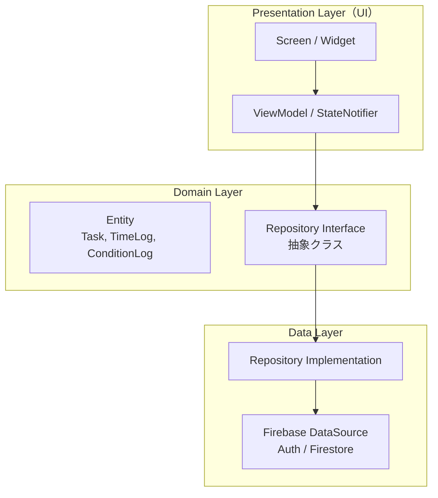
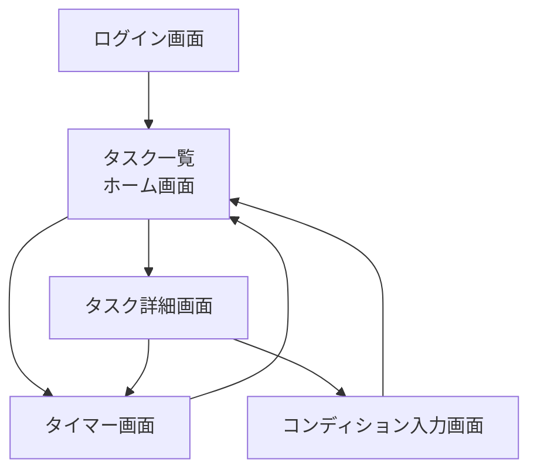

# SyncScale スマートフォンアプリ — System Design Document

> **SyncScale システムの「相対見積もり」と「計測・振り返り」を担うFlutterアプリ**

---

## 1. 概要

### 1.1 本アプリの位置づけ

| Step | 手法 | 担当 |
|------|------|------|
| 1. 自動収集 | LMSから課題・〆切を自動取得 | Chrome拡張機能 |
| **2. 相対見積もり** ★ | S/M/L ラベリング | **スマートフォンアプリ（本設計書）** |
| **3. 計測と振り返り** ★ | タイマー計測・コンディション入力 | **スマートフォンアプリ（本設計書）** |
| 4. データの可視化 | ダッシュボードで分析 | PCのWebアプリ |

### 1.2 主な機能

1. **タスク一覧の閲覧**: Firestore上の `tasks` を一覧表示（Webアプリ・Chrome拡張から登録されたものも含む）
2. **相対見積もり（S/M/L）**: 各タスクに対して規模ラベルを付与する
3. **タイマー計測**: 作業中の実働時間をリアルタイム計測し、`timeLogs` に記録
4. **コンディション入力**: タスク完了時に心身の状態（良/中/悪）を `conditionLogs` に記録
5. **簡易振り返り**: タスクごとの作業ログ一覧・合計時間の表示

### 1.3 連携先

- **Firestore**: Webアプリ・Chrome拡張と同一の `tasks` / `timeLogs` / `conditionLogs` コレクション
- **Firebase Auth**: Webアプリと同一ユーザーとしてGoogleログイン

---

## 2. アーキテクチャ

### 2.1 レイヤー構成

Webアプリのレイヤードアーキテクチャと思想を揃える。
Flutter版では **MVVM + Repository パターン** を採用する。



#### Webアプリとの対応表

| Webアプリ | Flutterアプリ | 責務 |
|---|---|---|
| `src/components/` | `lib/presentation/screens/` + `widgets/` | UI表示 |
| `src/hooks/` | `lib/presentation/viewmodels/` | 状態管理・ユースケース |
| `src/services/` | `lib/data/repositories/` + `datasources/` | Firebase通信 |
| `src/domain/` | `lib/domain/entities/` | エンティティ・ビジネスロジック |

### 2.2 なぜこの分離が必要か（初心者向け解説）

```
📌 Presentation Layer（見た目の層）:
   → 画面に何を表示するか、ボタンを押したら何が起きるかを管理。
   → Firebaseの存在を知らない。「データをくれ」「データを保存して」と頼むだけ。

📌 Domain Layer（ルールの層）:
   → 「タスクとは何か」「時間負債はどう計算するか」を定義する。
   → 純粋なDartクラス。Firebaseにもflutterにも依存しない。

📌 Data Layer（通信の層）:
   → 実際にFirestoreやFirebase Authと通信する。
   → 将来バックエンドが変わっても、ここだけ差し替えれば済む。
```

---

## 3. ディレクトリ構成

```
lib/
├── main.dart                          # アプリのエントリポイント
├── app.dart                           # MaterialApp, ルーティング定義
│
├── core/                              # アプリ全体で共有する設定・ユーティリティ
│   ├── firebase_options.dart            # FlutterFire CLI で自動生成
│   ├── theme.dart                       # テーマ定義（色・フォント）
│   └── constants.dart                   # 定数定義
│
├── domain/                            # Domain Layer: エンティティ・ビジネスロジック
│   ├── entities/
│   │   ├── task.dart                    # Task エンティティ
│   │   ├── time_log.dart                # TimeLog エンティティ
│   │   └── condition_log.dart           # ConditionLog エンティティ
│   ├── repositories/                    # Repository Interface（抽象クラス）
│   │   ├── task_repository.dart
│   │   ├── time_log_repository.dart
│   │   └── condition_log_repository.dart
│   └── logic/
│       └── analytics.dart               # 時間負債計算などの純粋関数
│
├── data/                              # Data Layer: Firebase通信の実装
│   ├── datasources/
│   │   └── firebase_datasource.dart     # Firebase初期化・共通処理
│   └── repositories/
│       ├── task_repository_impl.dart     # Firestore tasks 操作
│       ├── time_log_repository_impl.dart
│       └── condition_log_repository_impl.dart
│
└── presentation/                      # Presentation Layer: UI
    ├── viewmodels/
    │   ├── auth_viewmodel.dart           # 認証状態管理
    │   ├── task_list_viewmodel.dart      # タスク一覧の状態管理
    │   ├── timer_viewmodel.dart          # タイマーの状態管理
    │   └── condition_viewmodel.dart      # コンディション入力の状態管理
    ├── screens/
    │   ├── login_screen.dart             # ログイン画面
    │   ├── task_list_screen.dart         # タスク一覧画面（ホーム）
    │   ├── task_detail_screen.dart       # タスク詳細・見積もり・ログ
    │   ├── timer_screen.dart             # タイマー画面
    │   └── condition_input_screen.dart   # コンディション入力画面
    └── widgets/
        ├── size_label_selector.dart      # S/M/L ラベル選択ウィジェット
        ├── timer_display.dart            # タイマー表示ウィジェット
        └── condition_selector.dart       # 良/中/悪 選択ウィジェット
```

---

## 4. 画面設計

### 4.1 画面遷移図



### 4.2 各画面の詳細

---

#### 📱 ログイン画面 (`login_screen.dart`)

```
┌───────────────────────┐
│                       │
│      🔄 SyncScale      │
│                       │
│   タスク管理を始めよう   │
│                       │
│  [ Google ログイン ]   │
│                       │
└───────────────────────┘
```

- Googleログインボタンのみ
- ログイン成功 → タスク一覧画面へ遷移
- WebアプリのFirebase Authと同一プロジェクトを使用

---

#### 📱 タスク一覧画面 — ホーム (`task_list_screen.dart`)

```
┌───────────────────────┐
│ 🔄 SyncScale   [👤]    │
│───────────────────────│
│ 未着手 (3)             │
│ ┌───────────────────┐ │
│ │ レポート課題A      │ │
│ │ 〆切: 6/15  [  ]  │ │
│ │ 見積: 未設定       │ │
│ └───────────────────┘ │
│ ┌───────────────────┐ │
│ │ 小テスト準備       │ │
│ │ 〆切: 6/10  [ S ] │ │
│ │ 見積: S (30分)     │ │
│ └───────────────────┘ │
│                       │
│ 作業中 (1)             │
│ ┌───────────────────┐ │
│ │ ▶ プレゼン資料作成  │ │
│ │ 〆切: 6/20  [ M ] │ │
│ │ 実績: 1h30m / 3h   │ │
│ └───────────────────┘ │
│                       │
│    [ ⏱ タイマー開始 ] │
└───────────────────────┘
```

- **機能**: Firestoreの `tasks` をリアルタイム同期で表示（`snapshots()`）
- **表示**: ステータス別（TODO / DOING / DONE）にグループ化
- **操作**:
  - タスクカードタップ → タスク詳細画面へ
  - 「タイマー開始」ボタン → タイマー画面へ
  - S/M/L バッジが未設定のタスクは目立つように表示

---

#### 📱 タスク詳細画面 (`task_detail_screen.dart`)

```
┌───────────────────────┐
│ ← タスク詳細           │
│───────────────────────│
│ レポート課題A           │
│ 〆切: 2026/06/15       │
│ 登録元: Chrome拡張      │
│ ステータス: TODO        │
│                       │
│ ── 相対見積もり ──      │
│  [ S ]  [*M*]  [ L ]  │
│  目安: 1日以内で終わる   │
│                       │
│ ── 作業ログ ──          │
│  (まだ記録がありません)  │
│                       │
│ [ ⏱ この課題で計測 ]   │
│                       │
│ ── 完了時 ──            │
│ [ ✅ 完了にする ]       │
└───────────────────────┘
```

- **相対見積もり**: S/M/Lの3ボタンで選択。選択即保存（`sizeLabel` を更新）
- **作業ログ**: そのタスクに紐づく `timeLogs` を一覧表示（サブタスク名・時間）
- **完了操作**: ステータスを 'DONE' にし、`completedAt` をセット → コンディション入力画面へ遷移

---

#### 📱 タイマー画面 (`timer_screen.dart`)

```
┌───────────────────────┐
│ ← タイマー             │
│───────────────────────│
│                       │
│   プレゼン資料作成 ▼    │
│                       │
│   作業内容:            │
│   [資料探し] [執筆]     │
│   [その他: _________ ] │
│                       │
│       01:23:45         │
│                       │
│   [  ⏸ 一時停止  ]    │
│                       │
│   [ 📝 きろく ]        │
│                       │
└───────────────────────┘
```

- **機能**: Webアプリの Timer.jsx と同等
- **挙動**:
  - Start → タイマー開始。Pause → 一時停止（累積保持）。きろく → DB保存＆リセット
  - 初回記録時に `startedAt` がnullなら自動セット + ステータスを 'DOING' に更新
  - **バックグラウンド対応**: `DateTime.now() - startTime` 方式で正確な経過時間を算出
- **作業内容**: AIサジェストは将来対応。まずはプリセット＋自由記述で実装

---

#### 📱 コンディション入力画面 (`condition_input_screen.dart`)

```
┌───────────────────────┐
│ ← 振り返り             │
│───────────────────────│
│                       │
│ 「レポート課題A」       │
│  お疲れさまでした！      │
│                       │
│ 今の調子はどうですか？   │
│                       │
│  [ 😊 良 ]             │
│  [*😐 中*]             │
│  [ 😓 悪 ]             │
│                       │
│ メモ (任意):            │
│ ┌─────────────────┐   │
│ │ 集中できた        │   │
│ └─────────────────┘   │
│                       │
│    [ 記録する ]        │
└───────────────────────┘
```

- **機能**: タスク完了時に心身のコンディションを記録
- **保存先**: `conditionLogs` コレクション
- **遷移**: 記録後 → タスク一覧画面へ戻る

---

## 5. Firestoreスキーマ（Webアプリと共通）

本アプリが読み書きするコレクション。**WebアプリのSystemDesign-v2と完全一致**。

### 読み取り: `tasks`（全フィールド）
### 書き込み: `tasks`（以下のフィールドを更新）

| フィールド | 更新タイミング |
|---|---|
| `sizeLabel` | 相対見積もり選択時 |
| `status` | タイマー初回記録時（TODO→DOING）、完了操作時（→DONE） |
| `startedAt` | タイマー初回記録時（nullなら現在時刻をセット） |
| `completedAt` | 完了操作時 |

### 書き込み: `timeLogs`（新規作成）

```dart
{
  'userId': currentUser.uid,
  'taskId': selectedTask.id,
  'subTaskName': '資料探し',
  'startTime': Timestamp.fromDate(startTime),
  'endTime': Timestamp.fromDate(endTime),
  'durationSeconds': 3600,
  'createdAt': FieldValue.serverTimestamp(),
}
```

### 書き込み: `conditionLogs`（新規作成）

```dart
{
  'userId': currentUser.uid,
  'taskId': completedTask.id,
  'condition': 'good',   // 'good' / 'fair' / 'poor'
  'memo': '集中できた',
  'createdAt': FieldValue.serverTimestamp(),
}
```

---

## 6. 技術スタック

| 区分 | 技術 | 備考 |
|------|------|------|
| フレームワーク | Flutter (Dart) | iOS / Android 両対応 |
| 認証 | `firebase_auth` + `google_sign_in` | Webアプリと同一プロジェクト |
| DB | `cloud_firestore` | リアルタイム同期 (`snapshots()`) |
| 状態管理 | `Riverpod` (推奨) or `setState` | 初期はsetStateでも可、規模拡大時にRiverpodへ移行 |
| Firebase設定 | `flutterfire_cli` | `flutterfire configure` で自動生成 |

### 主要パッケージ（pubspec.yaml）

```yaml
dependencies:
  flutter:
    sdk: flutter
  firebase_core: ^latest
  firebase_auth: ^latest
  cloud_firestore: ^latest
  google_sign_in: ^latest
```

---

## 7. 認証とセキュリティ

- **Googleログイン**: `google_sign_in` + `firebase_auth` で実装
- Webアプリと**同一のFirebaseプロジェクト**を使用するため、同じユーザーUIDでデータにアクセスできる
- Firestoreセキュリティルール: `request.auth.uid == resource.data.userId` で読み書き制限（Webアプリと共通）

### Firebase設定の共有方法

```
1. Firebase Consoleで既存プロジェクトにAndroid/iOSアプリを追加
2. flutterfire configure を実行して firebase_options.dart を生成
3. 同一プロジェクトなので、同じFirestoreコレクションに自動接続される
```

---

## 8. 実装Phase

### Phase 1: プロジェクトセットアップ & ログイン
- `flutter create` でプロジェクト作成
- `flutterfire configure` でFirebase接続
- Googleログイン画面の実装
- Webアプリと同じユーザーでログインできることを確認

### Phase 2: タスク一覧画面（読み取り専用）
- Firestoreの `tasks` コレクションをリアルタイム取得（`snapshots()`）
- ステータス別にグループ化して表示
- **この時点ではデータの書き込みはしない。Webアプリで登録したタスクが見えることを確認**

### Phase 3: 相対見積もり（S/M/L）
- `SizeLabelSelector` ウィジェットの実装
- タスク詳細画面で S/M/L を選択 → Firestore更新
- Webアプリ側でラベルが反映されることを確認

### Phase 4: タイマー機能
- タイマー画面の実装（Start/Pause/Record）
- `timeLogs` への書き込み
- `startedAt` の自動セット、ステータス自動更新（TODO→DOING）

### Phase 5: コンディション入力
- コンディション入力画面の実装（良/中/悪 + メモ）
- `conditionLogs` への書き込み
- タスク完了フロー（DONE + completedAt + コンディション記録）の一連動作確認
